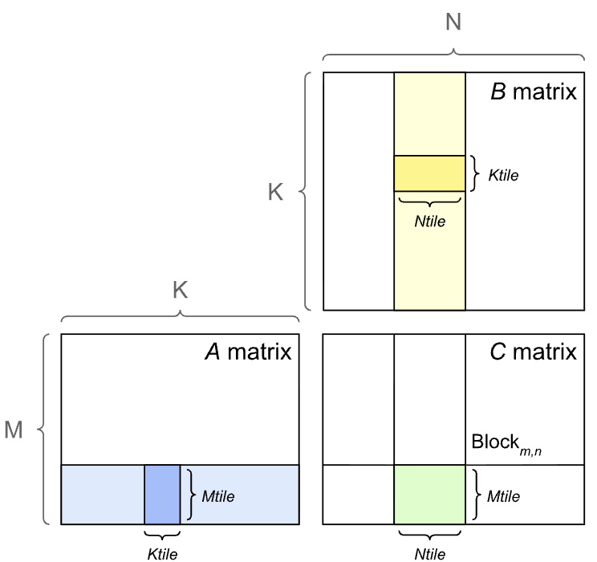

# Sgemm
### 单精度矩阵乘法(float/FP32)性能优化
### 衡量指标: 计算访存比(总FLOP / 从全局内存读写的总字节数)

## 参考
* [CUDA矩阵乘法终极优化指南](https://zhuanlan.zhihu.com/p/410278370)
* [GEMM理论性能分析与kernel优化](https://zhuanlan.zhihu.com/p/441146275)
* [深入浅出GPU优化系列：GEMM优化(一)](https://zhuanlan.zhihu.com/p/435908830)

## 配置
* 输入输出
    * A: M * K
    * B: K * N
    * C: M * N  
* kernel配置
    * blockDim: 16 * 16
* 数据配置
    * M = 512
    * N = 128
    * K = 256
* 总计算量
    * 2*M*N*K FLOP    

## Naive: 全局显存
> 在一个thread block内部256个线程同时处理256个结果cell. 每个cell需要一个线程读取A[i][0~K-1]和B[0~K-1][j]共2K次，再写入C[i][j]中.
* 线程数目: M*N
* read: 2K*M*N次
* write: M*N次
* 访存量(读): 2KMN * 4Bytes = 8KMN
* 计算访存比: 2KMN/8KMN = 0.25FLOP/Byte

## Opt1: 分块共享内存
> 在一个thread block循环遍历K维分块，每次将A的一个行子块和B的一个列子块加载到共享内存中，然后累加求部分和. 每个A,B矩阵的元素都被加载了一次.
* 分块大小: 16 * 16
* read: K*M+K*N次
* write: M*N次
* 访存量(读):  
    * A: K*M*4 Bytes
    * B: K*N*4 Bytes
* 计算访存比: MN/2(M+N) FLOP/Byte

### 性能分析角度
假设M=N=K=16, 计算访存比=64FLOP/Byte;
比如GPU参数: 内存带宽:1000GB/s  计算能力: 10TFLOPS
* Naive版本 ： 1000GB/s * 0.25 = 250GFLOPS (只用了2.5%算力)
* Tiled版本: 1000GB/s * 64 = 64TFLOS > 10TFLOS(用满算力/受限于带宽)

### 数据角度
    1. tileA[5][7]这个数据
        * 由线程(threadIdx.x = 5, threadIdx.y=7)加载到缓存
        * 被thread[5][0], thread[5][1]...thread[5][15]这16个线程读取16次
    2. tileB[5][7]这个数据
        * 由线程(threadIdx.x = 5, threadIdx.y=7)加载到缓存
        * 被thread[0][7],thread[1][7]...thread[15][7]这16个线程读取16次

## Opt2: 向量化加载+Float4
> 一个thread block中的256个线程处理1024个数据, 一个线程处理4个数据. 
* 分块大小blockDim: 16x16
* 每个block的数据量: 32x32 

### 性能分析角度
* 宏观计算访存比: MN/2(M+N) FLOP/Byte (与普通分块算法相同-衡量算法受全局内存带宽的限制程度) 
* 指令级计算指令与访存指令比例 (衡量影响线程级并行时的延迟隐藏能力):
  *  普通分块：每个线程计算一个结果，每次迭代执行2次共享内存load和一次FMA
     *  2 load : 1 FMA
  *  寄存器分块：每个线程计算4个结果，每次迭代执行4次共享内存load和4次FMA
     *  4 load : 4 FMA
  
寄存器分块高效的本质就是：并未改变宏观计算访存比，但是在指令级别，提高了每次缓存访问的数据读取量——因此减少了每个warp的内存访问量，使得该warp更容易成为活跃warp从而进行延迟隐藏.

## Opt3: 寄存器分块+内积转外积+索引重排+转置
### 从Global Mem到shared Mem
访存算法：确定结果矩阵有多少个block，每个block的访存量，两者相乘
* 全局版本(GM访存): M*N个block，每个2K次——2MNK
* 分块版本(GM访存): 共M/bm * N/bn个block，每个K/bk次——访存比例为1/2(1/bm+1/bn)
    * 这个值忽略了L2硬件缓存的功能，是一个Lower Bound
    * 分块的Upper Bound是L2优化导致所有元素只读一次: 8KMN
* 寄存器分块版本(SM访存): bm/rm * bm/rn个block，每个bk/rk次——1/2(1/rm + 1/rn)
    * shared mem没有额外的缓存层，所以这个值是固定的
  